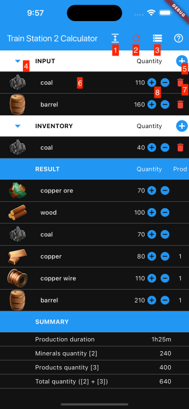
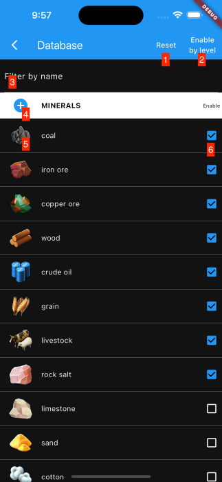
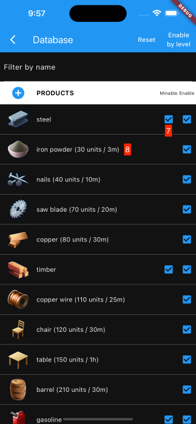

# End-User Manual

## I. Begin

On the fist time launching this app, you should visit the **Database Screen** (button number **3** on **Main Screen**) and apply your settings.

## II. Main Screen

This is the 1st screen when you launch this app and where you make calculations.

There are 4 sections:
- **INPUT**: list of items that you require.
- **INVENTORY**: list of items that you have already in your **Warehouse**.
- **RESULT**: list of result items that you need to mine or produce.
  - Column **Quantity**: item amount.
  - Column **Prod**: number of times that you have to produce the item in the factory.
- **SUMMARY**:
  - **Production duraton**: Total time to produces required products. In game, productions are produced parallely in differents factories; in-game-time may be lower.
  - **Minerals quantity**: amount of minerals - materials to produce products.
  - **Products quantity**: amount of products (products to be produced + products to be transfered from map factories).

Controls:
- Use buttons **4** to fold/unfold equivalent **INPUT** and **INVENTORY** sections. Use buttons **1** to fold/unfold both sections.
- Use button **2** to clear all calculations (also clear item selection history in **Selection Screen**). Use button **7** to remove the item.
- Use button **3** to go to **Database Screen**.
- Use button **5** to go to **Selection Screen** to add item to equivalent section.
- Tap on item row (**6**) to edit item's quantity.
- Use button +/- (**8**) to add/remove am amount to the current quantity of equivalent item.
- Note: editing quantity of items in **RESULT** section is applied to **INVENTORY** section.

## II. Selection Screen

This is the screen where you select item for **Main Screen** (and for some features in **Database Screen**).

- Input text into field **1** to filter items which contain the given text.
- Tap on item row to select.

## III. Database screen

This is where list all items and allow you to apply settings.

There are 2 sections:

- **MINERALS**: items that you have to transport from mines on the map.
- **PRODUCTS**: items that you have to produce in factories at your station.

Controls

- Input text into field **3** to filter items which contain the given text.
- Use checkmark **Enable** (**6**) to enable/disable item.
- Some products have factory on the map (so you don't need to produce in the factory at your station). Turn on checkmark **Minable** (**7**) if you have unlocked the product factory on the map.
- Use button **Reset** (**1**) to reset database to default.
- Use button **Enable by level** (**2**) to enable items based on your **level**. This also enables all the products **Minable** so you may have to manualy turn it off.
- User button **+** (**4**) to add your own item. The checkmark **Enable** (**6**) is replaced by **Delete** button (Your own item has not **Enable** property - it is always enabled).
- Tap on item icon (**5**) to change item icon.

- Tap on product name (**8** - Name (Amount / Time for each production)) to go to **Product Detail Screen** to edit product detail.

## IV. Product Detail Screen

**GENERAL**

Some fields are hidden depending on product settings.

- **Enable**: product enable (equivalent checkmark **6** on **Database Screen**).
- **Region factory available**: there is a region factory for current product. If this option is enable, checkmark **7** on **Database Screen** is visible.
- **Region factory unlocked**: the region factory is unlocked. This option is equivalent to checkmark **7** on **Database Screen**.
- **Production quantity** & **Production duration**: the quantity and the duration each time to produce the product in the factory at your station.

**MATERIAL**

List of materials to produce current product.

- Use button **+** (**1**) to add material to produce current product.
- Use button **3** to remove material.
- Tap on item row (**2**) to edit the quantity.
